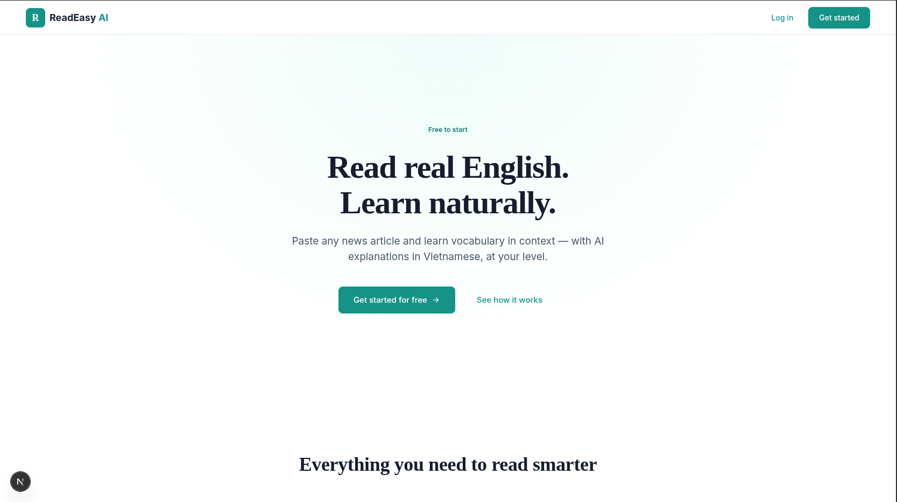
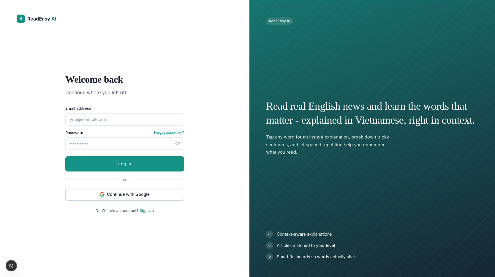
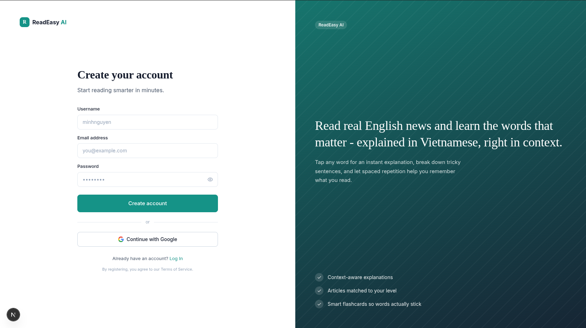
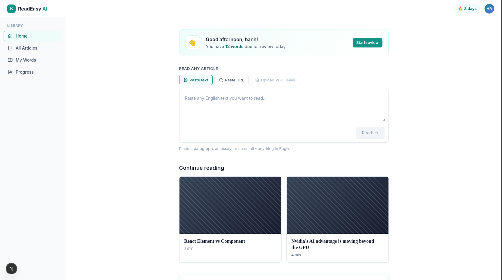
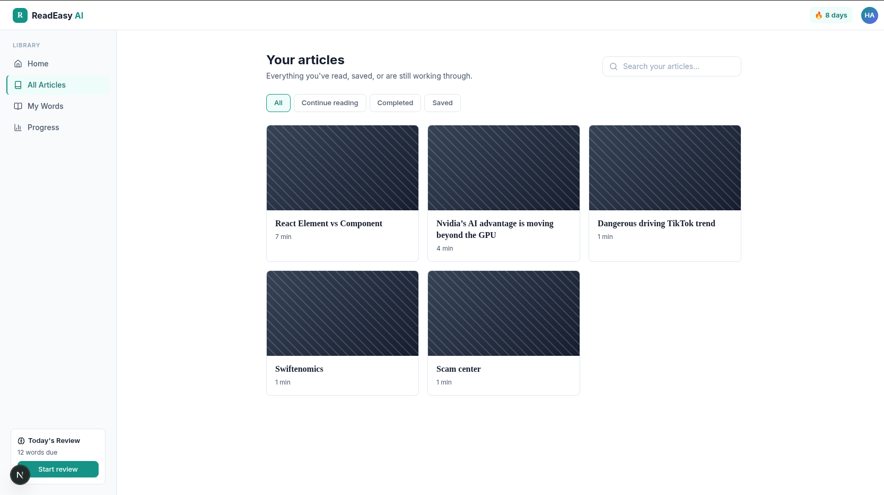
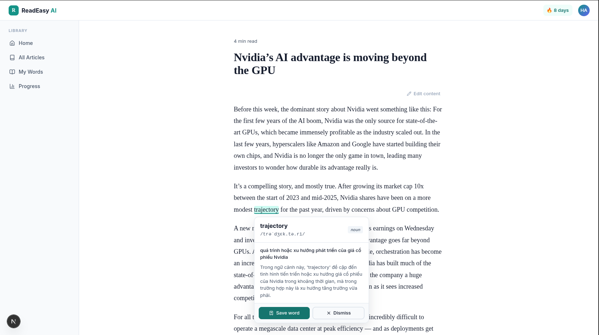
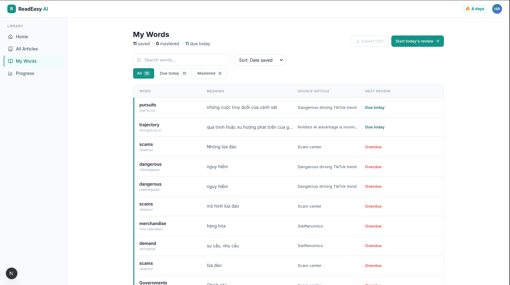
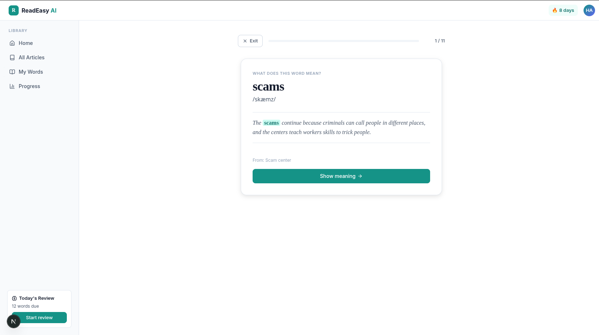
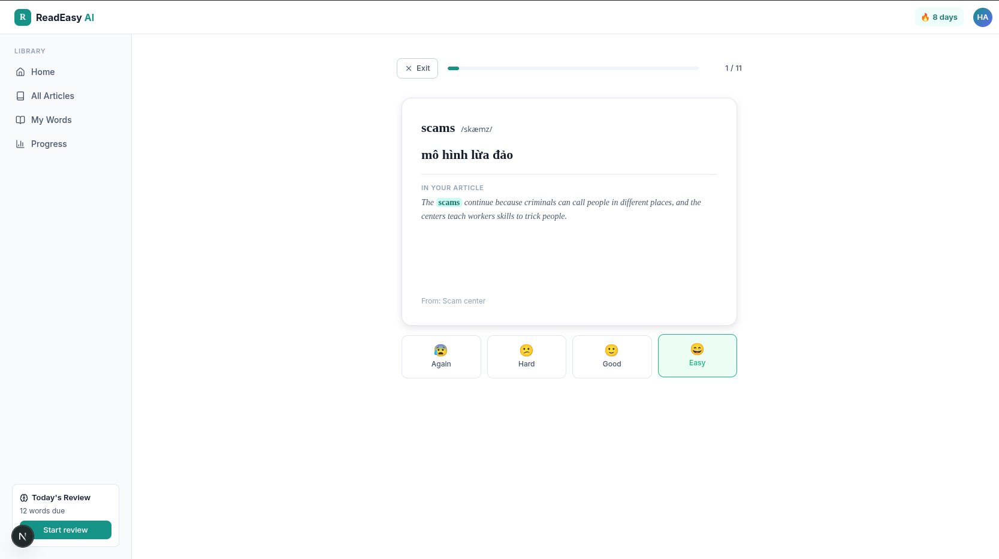

# ReadEasy

A web app that helps English learners read documents (articles, posts, papers) in English.

Core product loop:

**Read &rarr; Look up meaning in context &rarr; Save to vocab &rarr; Review via spaced-repetition flashcards**

## Tech stack

- **Framework**: Next.js (App Router)
- **Styling**: TailwindCSS
- **Database**: PostgreSQL
- **ORM**: Drizzle ORM
- **LLM**: OpenAI API for context-aware word translation and explanation
- **URL content extraction**: Mozilla Readability (`@mozilla/readability` + `jsdom`)
- **Auth**: custom email/password (JWT session cookie) + Google OAuth

## Screenshots

### Landing page


### Log in page


### Sign up page


### Home page



### Library page



### Reading view



### Vocabulary list



### Flashcard review




## Getting started

### Prerequisites

- Node.js and [pnpm](https://pnpm.io)
- A PostgreSQL database (local via Docker, or a hosted instance)

### Setup

1. Install dependencies:

   ```bash
   pnpm install
   ```

2. Copy `.env.example` to `.env` and fill in the values (see [Environment variables](#environment-variables)).

3. Push the database schema:

   ```bash
   pnpm db:push
   ```

4. Run the dev server:

   ```bash
   pnpm dev
   ```

   Open [http://localhost:3000](http://localhost:3000).

## Environment variables

| Variable | Description |
| --- | --- |
| `DATABASE_URL` | PostgreSQL connection string |
| `POSTGRES_USER` / `POSTGRES_PASSWORD` / `POSTGRES_DB` | Postgres credentials |
| `SESSION_SECRET` | Secret used to sign JWT session cookies |
| `GOOGLE_CLIENT_ID` / `GOOGLE_CLIENT_SECRET` | Google OAuth credentials for sign-in |
| `OPENAI_API_KEY` | API key for LLM-based word lookup |

## Commands

```bash
pnpm dev            # run dev server
pnpm build          # production build
pnpm lint           # lint
pnpm db:generate    # generate Drizzle migration files from schema.ts
pnpm db:push        # push Drizzle schema to Postgres directly (no migration files)
pnpm db:studio      # open Drizzle Studio
```

## Project structure

```
app/
  (auth)/            # sign in / sign up
  (app)/
    home/            # home / dashboard
    articles/        # document list, URL/text import
    read/[id]/       # reading view, word lookup
    words/           # vocab list and management
    review/          # flashcard review (SRS)
  api/
    auth/            # session + Google OAuth callback
    translate/       # server-side proxy to the LLM for word lookup
  lib/
    db/              # Drizzle schema + client
    dictionary/      # LLM provider integration (word lookup)
    auth/            # session/auth helpers
```
